# CSLaboratory-Legacy

## Overview
CSLaboratory-Legacy is a legacy project for [CSLaboratory](https://angelmsger.com/) which contain a [Android APP](android), a [API server](server) and a [crawler](crawler). **I have no longer maintained it for really a long time, this repo is only to archive the code and prove my workload**.

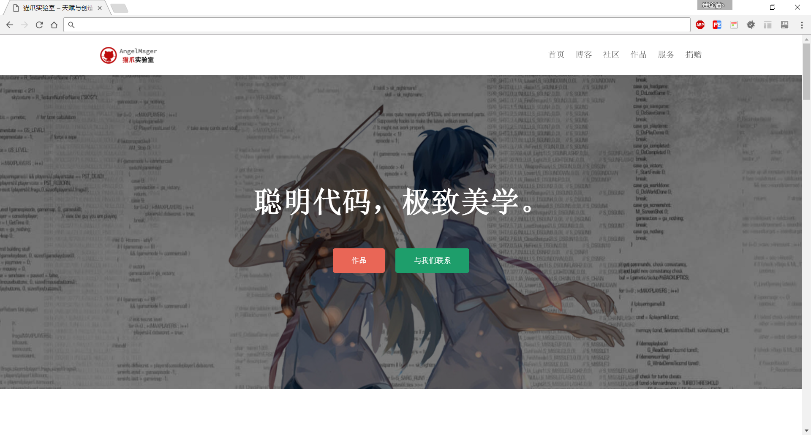
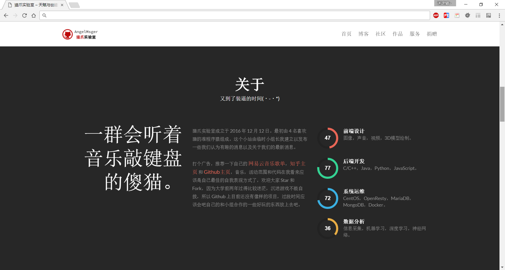
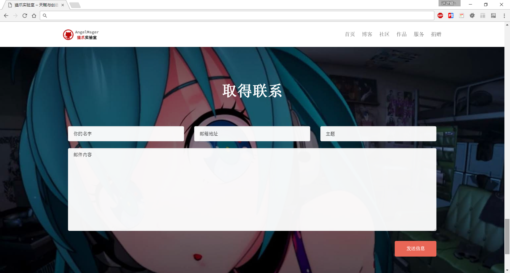
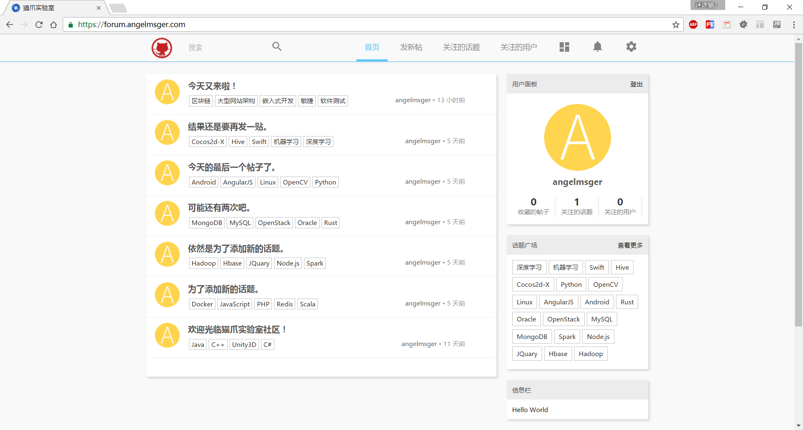
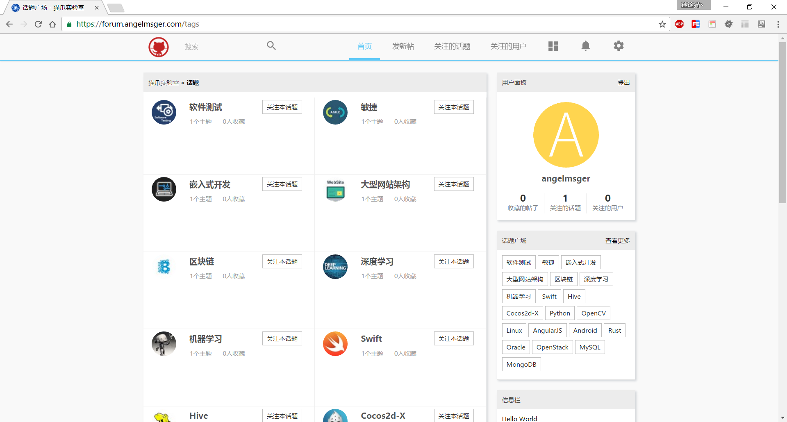
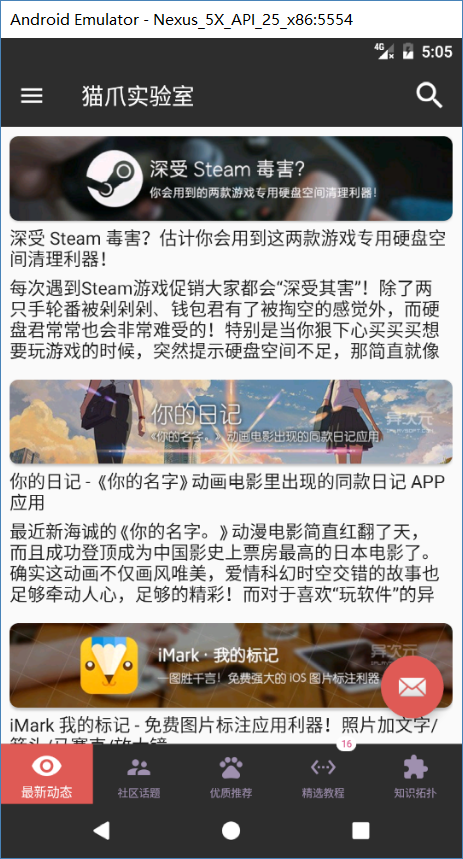
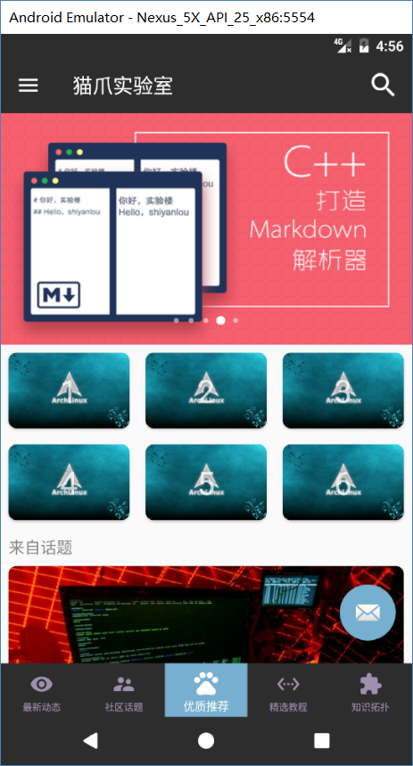
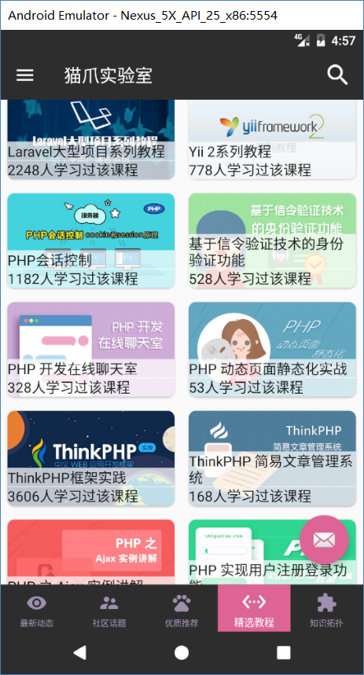
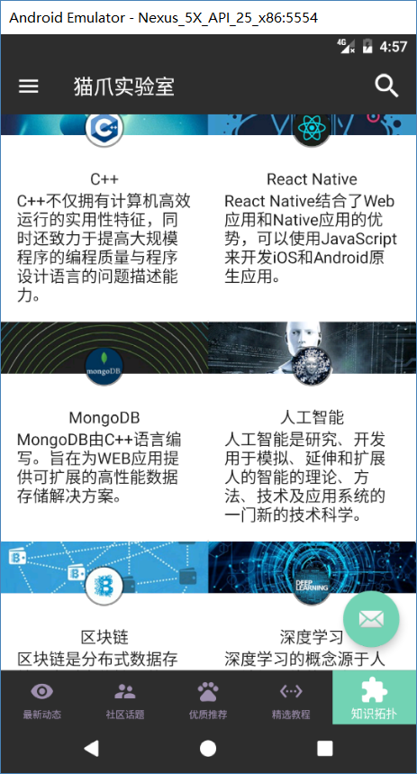
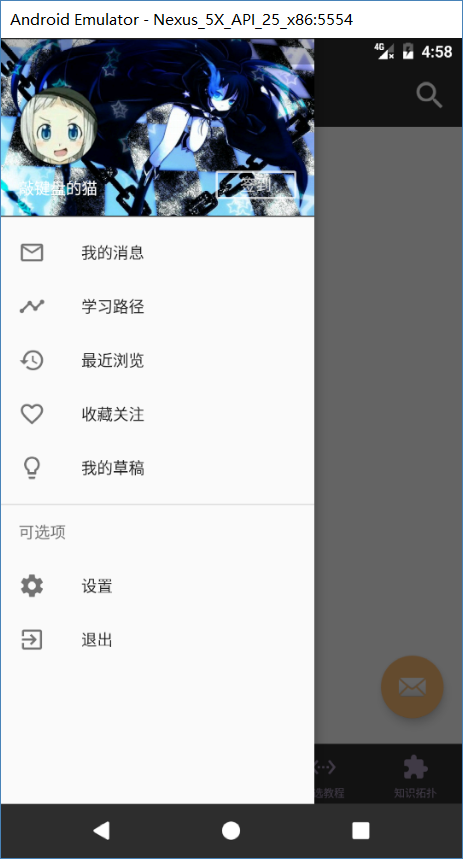
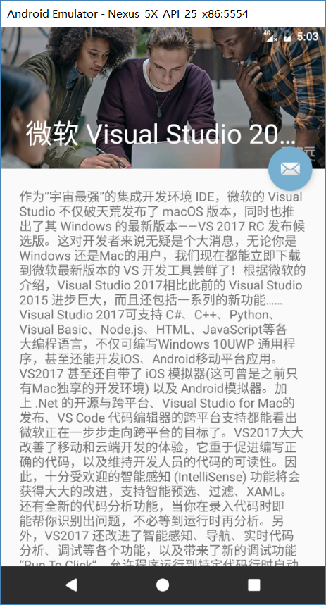

## Documents
You can find projects documents and code structure [here](docs).

## Quote
1. Use [Carbon-Forum](https://github.com/lincanbin/Carbon-Forum) to set up forum web pages(usage not include API).
